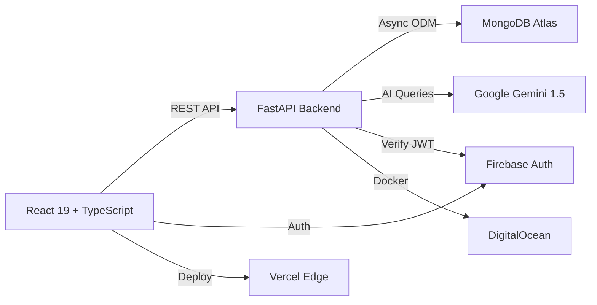

# 🚀 APEX

### **A**spire. **P**rogress. **E**nhance. **X**cel.

*The AI-Powered Social Learning Ecosystem That Transforms Education*

[](https://reactjs.org/)
[](https://www.typescriptlang.org/)
[](https://fastapi.tiangolo.com/)
[](https://www.mongodb.com/)
[](https://ai.google.dev/)

[🌐 Live Demo](https://apexedu.vercel.app/) · [🐛 Report Bug](mailto:harshareddy.bathala@gmail.com?subject=APEX%20Bug%20Report) · [✨ Request Feature](mailto:harshareddy.bathala@gmail.com?subject=APEX%20Feature%20Request)

 

---

## 💡 The Problem We're Solving

Traditional Learning Management Systems treat students as **data points** on a spreadsheet. They track grades, assignments, and attendance—but they miss the **human element**.

**What if education platforms could:**
- 🧠 Understand when a student is burned out *before* they fail?
- 🤝 Foster peer collaboration instead of isolated studying?
- 🎯 Provide personalized guidance that actually knows your context?
- 📊 Give teachers actionable insights, not just raw numbers?

**That's APEX.** Not another gradebook. A **Social-Academic Ecosystem** where students thrive, teachers lead strategically, and AI serves as an intelligent companion.

---

## ✨ What Makes APEX Different?

### 🧠 Context-Aware AI
**Not a generic chatbot**  
Your AI Mentor knows your name, grades, mood, and hobbies. It can query your assignments, find shared notes, and provide **personalized** guidance.

### 💬 Social Learning Layer
**Collaborate, don't compete**  
A Twitter-style Discussion Hub, peer-to-peer Resource Library, and verified teacher endorsements create a **community of learners**.

### 📊 Holistic Tracking
**Beyond grades**  
Track mental well-being with daily "Pulse" check-ins, visualize weekly progress, and build micro-habits—all in one dashboard.

---

## 🎬 Core Features

### 👨‍🎓 **For Students: Your Personal Growth Cockpit**

### 🤖 StudentHub AI Mentor

 

Powered by **Google ADK** and **Gemini 1.5 Flash**, this isn't your average chatbot:

```text
Deep Context Example
User: "Do I have homework due?"
AI: Queries MongoDB assignments collection
→ "Yes, Calculus is due tomorrow at 11:59 PM."

User: "Find me Physics notes."
AI: Searches resources collection
→ "Found 12 PDF notes on Thermodynamics. Here are the top 3..."
```

**Features:**
- ✅ Real-time database queries
- ✅ Mood-aware responses (detects stress patterns)
- ✅ Multi-turn conversations with memory
- ✅ Tool-use capabilities (search, filter, create tasks)

 

### 💬 Community Hub

 

A **Twitter-inspired discussion room** built for education:

- 📝 Post academic questions with **threaded replies**
- 👍 Upvote helpful answers
- 🏷️ Hashtag support (`#Calculus`, `#Programming`)
- ✅ **Verified Teacher Badges** to endorse correct solutions
- 🔍 Live search across thousands of posts

 

### 📚 Resource Library

 

Peer-to-peer note sharing that actually works:

- 📄 Upload PDF notes tagged by **Subject** and **Topic**
- 🔎 Robust search engine with instant filtering
- ⭐ Star/bookmark important resources
- 📊 View popularity metrics (downloads, views)

 

### 📊 Holistic Dashboard

 

Your command center for academic + personal growth:

- 🎯 **Weekly Progress Ring** – Real-time task completion visualization
- 💭 **Daily Pulse Check-In** – Log mood, wins, and blockers (feeds AI analytics)
- ✅ **Smart Habits Tracker** – Build micro-habits ("Read 10 mins", "Drink water")
- 📈 **Longitudinal Trends** – See your mood/productivity patterns over time

 

---

### 🍎 **For Teachers: Strategic Command Center**

### 🛡️ AI-Powered Analytics

 

Forget raw spreadsheets. Get **AI-generated insights**:

```text
Alert: Student Emma Rodriguez
Risk Level: HIGH
Pattern Detected:

Missed 3 consecutive assignments

Reported "stressed" mood for 5 days

Average study time dropped 40%
Recommendation: Schedule 1-on-1 check-in
```

**The AnalyticsAgent scans:**
- ✅ Check-in data (mood + blockers)
- ✅ Assignment submissions
- ✅ Community engagement
- ✅ Resource usage patterns

 

### 📝 Assignment Management

 

Create assignments that **instantly sync** to student dashboards:

- 📅 ISO date enforcement (no invalid deadlines)
- 🏷️ Subject tagging for organization
- 📊 Live submission tracking
- 🔔 Automatic notifications to students

 

### 🔐 Role-Based Access Control

 

Teachers authenticated via Firebase custom claims:

```js
// Middleware Protection
if (user.role !== 'teacher') {
	throw new UnauthorizedError('Students cannot access this endpoint');
}
```

**Strict separation** ensures students can't delete assignments or access analytics.

 

---

## 🏗️ Technical Architecture

APEX is built for **scale, performance, and developer experience**.



### 🎨 **Frontend**
- **Framework:** React 19 (Vite) + TypeScript
- **Styling:** Tailwind CSS + Custom Design System (Glassmorphism)
- **Animations:** Framer Motion
- **Icons:** Lucide React
- **State:** Context API + React Query

### ⚡ **Backend**
- **Framework:** Python FastAPI (Fully Async)
- **ODM:** Beanie (Async MongoDB Object Document Mapper)
- **AI Engine:** Google ADK (Agent Development Kit)
- **Model:** Gemini 1.5 Flash
- **Auth:** Firebase Admin SDK (JWT Verification)

### 🗄️ **Database**
- **MongoDB Atlas** (NoSQL)
- **Why MongoDB?**
	- Complex social graphs (followers/following)
	- Threaded discussions
	- Flexible resource metadata
	- Async-first with Motor

### 🚀 **Deployment**
- **Frontend:** Vercel (Global Edge Network)
- **Backend:** DigitalOcean App Platform (Docker)
- **Database:** MongoDB Atlas (Shared Cluster → Production-ready)

---

## 🛠️ Local Development Setup

### Prerequisites

Make sure you have these installed:

```bash
node -v # v18+
python -v # 3.11+
```

You'll also need:
- 🍃 MongoDB Atlas account ([free tier](https://www.mongodb.com/cloud/atlas/register))
- 🔥 Firebase project with Auth enabled
- 🤖 Google AI Studio API Key ([get here](https://aistudio.google.com/))

---

### 📥 Step 1: Clone the Repository

```bash
git clone https://github.com/harshareddy-bathala/studentMentor.git
cd apex
```

---

### 🐍 Step 2: Backend Setup

```bash
cd student-mentor-backend

# Create virtual environment
python -m venv .venv

# Activate it (Windows)
.\.venv\Scripts\Activate.ps1

# Activate it (Mac/Linux)
source .venv/bin/activate

# Install dependencies
pip install -r requirements.txt
```

---

### 🔑 Step 3: Environment Variables

Create a `.env` file in `student-mentor-backend/`:

```env
# MongoDB
MONGODB_URL=mongodb+srv://<user>:<pass>@cluster0.mongodb.net
DATABASE_NAME=student_mentor

# Google AI
GOOGLE_API_KEY=AIzaSy...
GEMINI_MODEL=gemini-1.5-flash

# Firebase
FIRESTORE_PROJECT_ID=your-project-id
GOOGLE_APPLICATION_CREDENTIALS=keys/service-account.json

# CORS
FRONTEND_URL=http://localhost:5173
```

**Download your Firebase Service Account JSON:**
1. Go to Firebase Console → Project Settings → Service Accounts
2. Click "Generate New Private Key"
3. Save as `keys/service-account.json` in the backend folder

---

### ⚛️ Step 4: Frontend Setup

```bash
# Back to root directory
cd ..

# Install frontend dependencies
npm install
```

Create a `.env.local` file in the **root directory**:

```env
VITE_FIREBASE_API_KEY=AIzaSy...
VITE_FIREBASE_AUTH_DOMAIN=your-app.firebaseapp.com
VITE_FIREBASE_PROJECT_ID=your-project-id
VITE_FIREBASE_STORAGE_BUCKET=your-app.appspot.com
VITE_FIREBASE_MESSAGING_SENDER_ID=123456789
VITE_FIREBASE_APP_ID=1:123456789:web:abcdef

VITE_MENTOR_BACKEND_URL=http://localhost:8000
```

---

### 🚀 Step 5: Run the Stack

**Terminal 1 (Backend):**

```bash
cd student-mentor-backend
uvicorn main:app --reload --port 8000
```

**Terminal 2 (Frontend):**

```bash
npm run dev
```

🎉 **Visit:** `http://localhost:5173`

---

## 🌍 Production Deployment

### 🐳 Backend (DigitalOcean App Platform)

1. **Create a Dockerfile** in `student-mentor-backend/`:

```dockerfile
FROM python:3.11-slim

WORKDIR /app
COPY requirements.txt .
RUN pip install --no-cache-dir -r requirements.txt

COPY . .

# Inject Service Account from Env Variable
RUN echo "$GOOGLE_APPLICATION_CREDENTIALS_JSON" > /app/keys/service-account.json

CMD ["uvicorn", "main:app", "--host", "0.0.0.0", "--port", "8000"]
```

2. **Deploy to DigitalOcean:**
	 - Connect your GitHub repo
	 - Set Environment Variables (including `GOOGLE_APPLICATION_CREDENTIALS_JSON`)
	 - DigitalOcean auto-detects Dockerfile

---

### ⚡ Frontend (Vercel)

1. **Push to GitHub**
2. **Import Project on Vercel:**
	 - Select your repo
	 - Set Environment Variables (all `VITE_*` variables)
	 - Build Command: `npm run build`
	 - Output Directory: `dist`

3. **Deploy!** ✨

---

## 🗂️ Project Structure

```text
apex/
├── src/ # Frontend (React + TypeScript)
│ ├── components/
│ │ ├── Dashboard.tsx
│ │ ├── ChatInterface.tsx
│ │ ├── CommunityHub.tsx
│ │ └── ResourceLibrary.tsx
│ ├── contexts/
│ │ ├── AuthContext.tsx
│ │ └── ThemeContext.tsx
│ ├── services/
│ │ ├── api.ts
│ │ └── firebase.ts
│ └── App.tsx
│
├── student-mentor-backend/ # Backend (FastAPI + Python)
│ ├── routers/
│ │ ├── students.py
│ │ ├── teachers.py
│ │ ├── chat.py
│ │ └── resources.py
│ ├── models/
│ │ ├── student.py
│ │ ├── assignment.py
│ │ └── discussion.py
│ ├── agents/
│ │ ├── student_hub_agent.py
│ │ └── analytics_agent.py
│ ├── main.py
│ └── requirements.txt
│
└── README.md
```

---

## 🔮 Future Roadmap

We're just getting started. Here's what's next:

- [ ] 🎮 **Gamification Engine** – Award badges for helping peers, maintaining streaks
- [ ] ☁️ **Real File Storage** – Migrate from URL mocking to AWS S3 / Firebase Storage
- [ ] 👨‍👩‍👦 **Parent Portal** – Read-only dashboard for guardians to track progress
- [ ] 📱 **Mobile App** – React Native version for iOS/Android
- [ ] 🌐 **Multi-Language Support** – i18n for global adoption
- [ ] 🔔 **Smart Notifications** – Push alerts for deadlines, replies, AI insights
- [ ] 📊 **Advanced Analytics** – ML models for predictive student performance

---

## 🤝 Contributing

We welcome contributions! Here's how you can help:

1. 🍴 Fork the repository
2. 🔀 Create a feature branch (`git checkout -b feature/amazing-feature`)
3. 💾 Commit your changes (`git commit -m 'Add amazing feature'`)
4. 📤 Push to the branch (`git push origin feature/amazing-feature`)
5. 🎉 Open a Pull Request

**Please read our [Contributing Guidelines](CONTRIBUTING.md) before submitting PRs.**

---

## 📄 License

This project is licensed under the **MIT License** – see the [LICENSE](LICENSE) file for details.

---

## 🙏 Acknowledgments

Built with love using these amazing technologies:

- [React](https://reactjs.org/) – UI Framework
- [FastAPI](https://fastapi.tiangolo.com/) – Backend Framework
- [MongoDB Atlas](https://www.mongodb.com/cloud/atlas) – Database
- [Google Gemini](https://ai.google.dev/) – AI Engine
- [Firebase](https://firebase.google.com/) – Authentication
- [Tailwind CSS](https://tailwindcss.com/) – Styling
- [Framer Motion](https://www.framer.com/motion/) – Animations

---

### 🚀 Built with ❤️ by [Harshavardhan Reddy](https://github.com/harshareddy-bathala)

**APEX** – *Where Students Aspire, Progress, Enhance, and Xcel.*

[](https://github.com/harshareddy-bathala/studentMentor)
[](https://twitter.com/__harshareddy)
[](https://instagram.com/soltrlx)

[⬆ Back to Top](#-apex)

